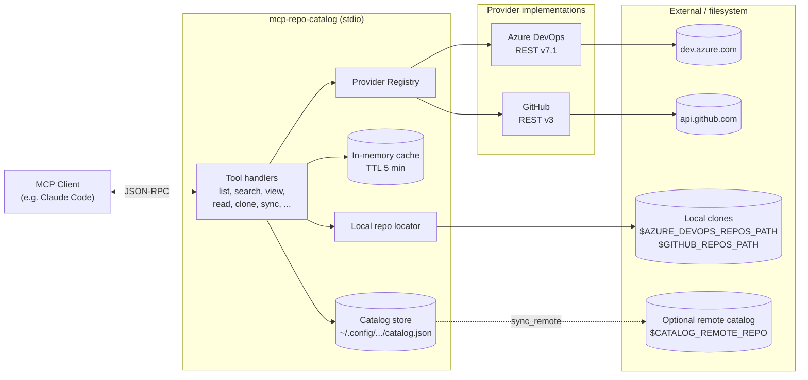
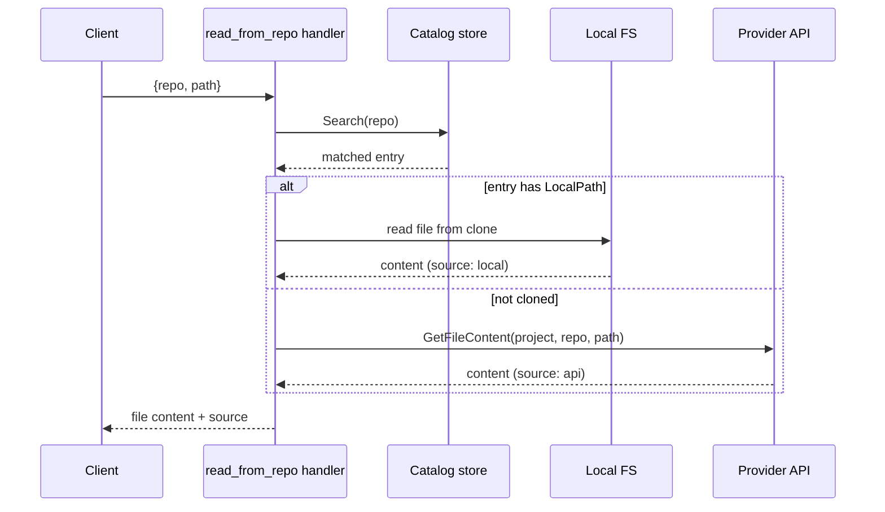

# mcp-repo-catalog

MCP server for discovering and exploring repositories across multiple git platforms. Supports **Azure DevOps** and **GitHub** simultaneously, with results aggregated from all configured providers.

## Architecture



### Request flow (example: `read_from_repo`)



## Tools

Always available:

| Tool | Description |
|------|-------------|
| `list_projects` | List all projects/organizations across configured providers |
| `search_repositories` | Search repositories by name, with local clone path when available |
| `get_repo_details` | Detailed metadata for a repo (README, last commit, size) |
| `view_catalog` | Show the local catalog grouped by provider |
| `read_from_repo` | Read a file from any cloned repo (cross-repo lookup) |
| `clone_repository` | Clone a repo into the configured local directory |

Mode-dependent:

| Tool | Mode | Description |
|------|------|-------------|
| `sync_remote` | Remote | Pull a central catalog repo and map local paths |
| `sync_catalog` | Local | Sync the catalog by querying provider APIs |
| `update_catalog_entry` | Local | Edit a catalog entry locally |

The mode is determined by the `CATALOG_REMOTE_REPO` env var: when set, the server runs in **remote** mode (read-only catalog from a shared repo); otherwise it runs in **local** mode.

## Installation

This repository ships in two layers: the **MCP server** (a Go binary) and a **Claude Code plugin** that bundles the server registration plus the [`enrich-catalog` skill](#workflow-catalog-enrichment). You can install either independently.

### Option 1 — Plugin (recommended for Claude Code users)

The plugin gives you the MCP server registration and the `enrich-catalog` skill in one install. You still need the binary on your `$PATH` (the plugin doesn't ship multi-platform binaries — see "Why no bundled binary" below).

**Step 1. Install the binary.**

```bash
go install github.com/heidiks/mcp-repo-catalog/cmd@latest
# or download a pre-built binary from https://github.com/heidiks/mcp-repo-catalog/releases
# and move it into a directory on $PATH (e.g. /usr/local/bin/)
```

Verify: `mcp-repo-catalog --version` should print the version.

**Step 2. Add the marketplace and install the plugin.**

In Claude Code:

```
/plugin marketplace add heidiks/mcp-repo-catalog
/plugin install mcp-repo-catalog@mcp-repo-catalog
```

**Step 3. Set the credentials in your shell** (the plugin's `.mcp.json` reads them from environment variables):

```bash
# ~/.zshrc or ~/.bashrc
export AZURE_DEVOPS_ORG=your-org
export AZURE_DEVOPS_TOKEN=...
export GITHUB_TOKEN=...
# optional
export AZURE_DEVOPS_REPOS_PATH=~/path/to/azure/repos
export GITHUB_REPOS_PATH=~/path/to/github/repos
```

**Why no bundled binary**: shipping pre-compiled binaries for linux/darwin/windows × amd64/arm64 inside the plugin would inflate the repo by ~40 MB per release and couple binary updates to the plugin release cadence. Goreleaser already publishes clean per-platform binaries via GitHub Releases, so the plugin defers to your `$PATH`. This is the same pattern used by language server plugins.

### Option 2 — Standalone MCP server (no plugin)

If you don't use Claude Code or want to register the MCP yourself:

```bash
go install github.com/heidiks/mcp-repo-catalog/cmd@latest
```

Or build from source:

```bash
git clone https://github.com/heidiks/mcp-repo-catalog
cd mcp-repo-catalog
make build   # binary at bin/mcp-repo-catalog
```

Then register manually with your MCP client (see [Claude Code](#claude-code) example below).

## Workflow: catalog enrichment

The plugin includes an `enrich-catalog` skill that turns dry catalog entries into rich documentation. Trigger it with phrases like *"enrich the catalog"* or *"document the repos"* and Claude Code will:

1. Call `view_catalog` and identify entries with empty fields.
2. Use `read_from_repo` to read `README.md`, `CLAUDE.md`, and dependency manifests (`go.mod`, `package.json`, `pom.xml`, etc.).
3. Detect monorepo signals (`go.work`, workspaces, `[workspace]`, multi-module Maven/Gradle).
4. Extract frameworks (Spring Boot, Next.js, Gin, FastAPI, ...) from the manifests, ignoring transitive deps.
5. Update entries via `update_catalog_entry` (or the upstream `.md` in remote mode).

The skill is generic — see `skills/enrich-catalog/SKILL.md` for the full ruleset and a "Customizing for your organization" section if you want to override domain tables, languages, or framework lists.

## Configuration

### Environment variables

| Variable | Required | Description |
|----------|----------|-------------|
| `AZURE_DEVOPS_ORG` | No* | Azure DevOps organization name |
| `AZURE_DEVOPS_TOKEN` | No* | Azure DevOps Personal Access Token |
| `AZURE_DEVOPS_REPOS_PATH` | No | Local path where ADO repos are cloned |
| `GITHUB_TOKEN` | No* | GitHub Personal Access Token |
| `GITHUB_ORGS` | No | Comma-separated list of GitHub orgs to list |
| `GITHUB_USER` | No | GitHub username for personal repos |
| `GITHUB_REPOS_PATH` | No | Local path where GitHub repos are cloned |
| `DISABLED_PROVIDERS` | No | Comma-separated providers to disable (`github`, `azuredevops`) |
| `CATALOG_REMOTE_REPO` | No | URL of a central catalog repo (enables remote mode) |
| `CATALOG_REMOTE_PATH` | No | Path within the remote repo where `.md` files live (default: `catalog/`) |

*At least one provider must be configured (Azure DevOps and/or GitHub).

### PAT permissions

- **Azure DevOps**: Code (Read), Project and Team (Read)
- **GitHub**: `repo` scope (or `public_repo` for public repos only)

### Claude Code

```bash
claude mcp add repo-catalog \
  --transport stdio \
  --scope user \
  --env AZURE_DEVOPS_ORG=your-org \
  --env 'AZURE_DEVOPS_TOKEN=${AZURE_DEVOPS_TOKEN}' \
  --env 'AZURE_DEVOPS_REPOS_PATH=~/path/to/azure/repos' \
  --env 'GITHUB_TOKEN=${GITHUB_TOKEN}' \
  --env 'GITHUB_REPOS_PATH=~/path/to/github/repos' \
  -- \
  /path/to/mcp-repo-catalog
```

Tokens (`AZURE_DEVOPS_TOKEN`, `GITHUB_TOKEN`) must be exported in your shell (e.g. `~/.zshrc`).

## Usage examples

- "List all projects in the organization"
- "Search for repositories with 'auth' in the name"
- "Get details of the go-monorepo in project backend"
- "Read the CLAUDE.md from the payments-api repo"
- "Clone the user-service repo locally"

## Supported providers

| Provider | Status | Config |
|----------|--------|--------|
| Azure DevOps | Supported | `AZURE_DEVOPS_ORG` + `AZURE_DEVOPS_TOKEN` |
| GitHub | Supported | `GITHUB_TOKEN` |
| GitLab | Planned | - |

## Development

```bash
make setup    # Create .env from .env.example
make build    # Build binary
make test     # Run tests with coverage
make lint     # Run linter
make fmt      # Format code
```

## License

MIT License. See [LICENSE](LICENSE).
